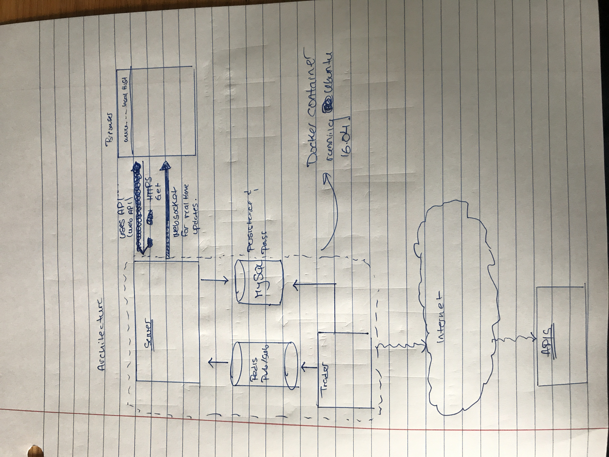

# *Oracle Reloaded*

Author:
- Luis Francisco Serazo :moneybag:

## Branches
   - a) Master
     	- No product ready code yet! 

   - b) First_Branch
     	- This is a branch that I will be working on for now. There is no product ready code in here yet. 

## Descrition:
Oracle Reloaded cryptocurrency trading bot which focuses on an arbitrage strategy. Therefore, executions must be *fast* and seemless. The main component of the bot is the **Trader**. The Trader is responsible for communicating with the various exchanges and scraping data. In order for there to be little error in execution. The Trader is designed to be a Finite State Machine. Therefore it can only be in one of several predetermined states at once. The bot should fail silently and when it does fail, it should no longer execute any more trades. 

## Persistance
Uses PostgreSQL for persistance. 

## Current progress in design:
*General Architecture* :

*Trader UML Diagram* :

